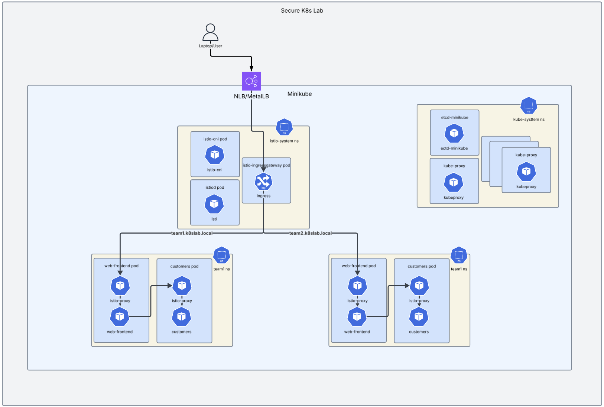
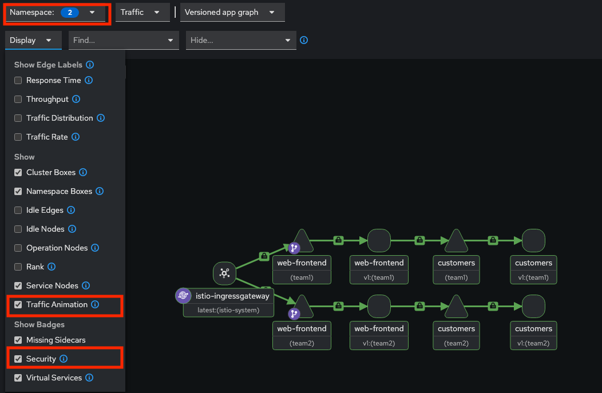
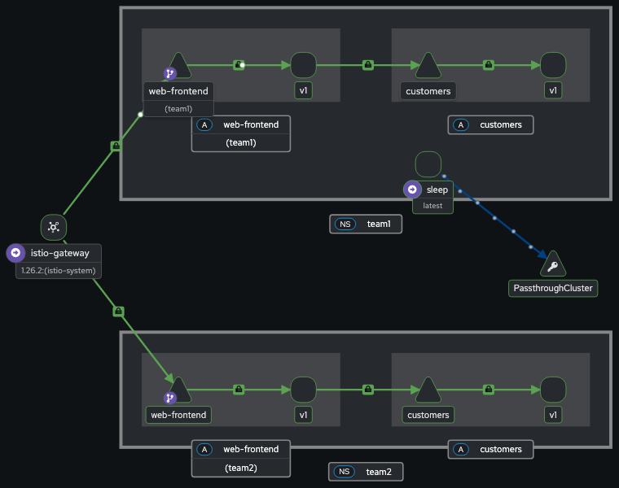
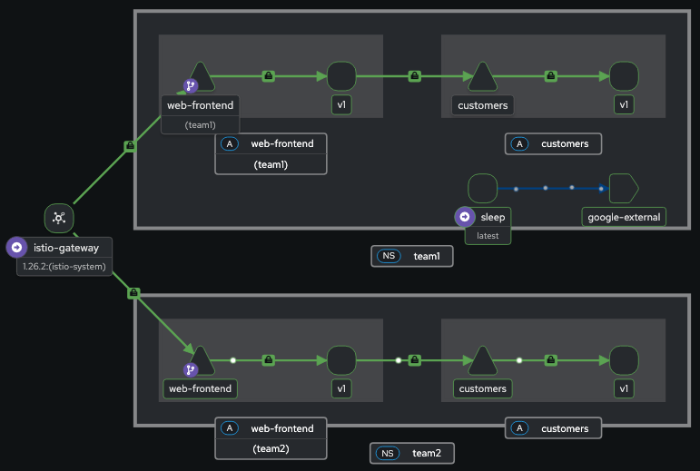
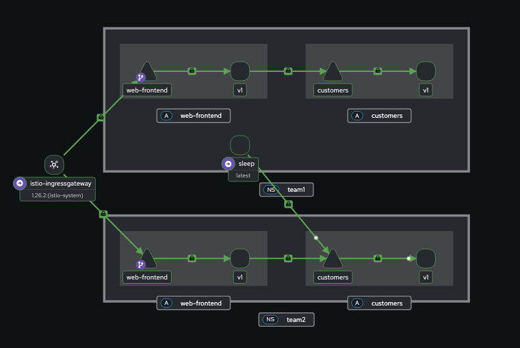

# Building Secure K8s Lab

This repo is meant to serve as a guide to get a working secure k8s demo/sandbox environment.

- Lab Diagram


Note: The Readme was developed on an Apple Silicon MacBook for support for Windows, see README_Windows.md.
To demo Argo deployment of Istio see README_argocd.md

The lab assumes the user is familiar with Kubernetes and related technologies.

## Prep and Pre reqs

### CLI Tools

- brew: <https://brew.sh>
- minikube: <https://minikube.sigs.k8s.io/docs/>
- colima: <https://github.com/abiosoft/colima>
- kubectl: <https://kubernetes.io/docs/reference/kubectl/>
- helm: <https://helm.sh>
- yq: <https://github.com/mikefarah/yq>
- istio: <https://istio.io/>

#### Install tools

- install brew: ```/bin/bash -c "$(curl -fsSL https://raw.githubusercontent.com/Homebrew/install/HEAD/install.sh)"```
- install colima: ```brew colima```
- install minikube: ```brew install minikube```
- install kubectl: ```brew install kubernetes-cli```
- install istioctl: ```brew install istioctl```
- install helm: ```brew install helm```

## Initial Development On Minikube with Colima on MacOS

```text
colima start --memory 9 --cpu 8
```

```text
minikube start --driver=docker --memory=8192 --cpus=8
```

### Verify pods are started

```text
kubectl get pods -A
NAMESPACE     NAME                               READY   STATUS    RESTARTS      AGE
kube-system   coredns-674b8bbfcf-gkxh9           1/1     Running   0             2m7s
kube-system   etcd-minikube                      1/1     Running   0             2m13s
kube-system   kube-apiserver-minikube            1/1     Running   0             2m13s
kube-system   kube-controller-manager-minikube   1/1     Running   0             2m13s
kube-system   kube-proxy-dtnh7                   1/1     Running   0             2m7s
kube-system   kube-scheduler-minikube            1/1     Running   0             2m13s
kube-system   storage-provisioner                1/1     Running   1 (97s ago)   2m12s
```

### Install Istio

```istioctl install --set meshConfig.accessLogFile=/dev/stdout -y```

#### Install Istio CNI

```text
istioctl install -y -f - <<EOF
apiVersion: install.istio.io/v1alpha1
kind: IstioOperator
spec:
  components:
    cni:
      namespace: istio-system
      enabled: true
EOF
```

### Install Security Components

#### Metrics Server

```text
helm repo add bitnami https://charts.bitnami.com/bitnami
helm repo update
helm install metrics-server bitnami/metrics-server \
  --version 7.2.0 \
  --namespace kube-system \
  --create-namespace \
  --values ./apps/metrics-server/values.yaml
```

#### OPA Gatekeeper

```text
helm repo add gatekeeper https://open-policy-agent.github.io/gatekeeper/charts
helm repo update
helm install gatekeeper-base gatekeeper/gatekeeper \
  --version 3.19.2 \
  --namespace gatekeeper-system \
  --create-namespace \
  --values ./apps/gatekeeper/values.yaml \
  --atomic \
  --timeout 5m
```

## Add applications

### Team1 App

- Create and label namespace

```text
kubectl create ns team1 && \
kubectl label ns team1 istio-injection=enabled
```

- Add app1 via helm to team1

```text
helm install app1 ./manifests/sample-apps/app1 -f ./apps/sample-apps/app1/values.yaml -n team1
```

- Note the application in team1 namespace has the Istio container added

### Team2 App

### Create a secure namespace for team2

```text
helm install secure-namespace-team2 ./manifests/secure-namespace \
  --set namespace=team2 \
  --create-namespace   
```

- Add app2 via helm to team2

```text
helm install app2 ./manifests/sample-apps/app1 -f ./apps/sample-apps/app2/values.yaml -n team2
helm install bad-app ./manifests/sample-apps/bad-app  -n team2 --set customerService.hostname=bad-app.test2.k8slab.local
W0720 18:06:38.229617   16287 warnings.go:70] would violate PodSecurity "restricted:latest": runAsNonRoot != true (pod or container "web" must set securityContext.runAsNonRoot=true)
NAME: app2
LAST DEPLOYED: Sun Jul 20 18:06:37 2025
NAMESPACE: team2
STATUS: deployed
REVISION: 1
W0720 18:06:38.746599   16298 warnings.go:70] would violate PodSecurity "restricted:latest": runAsNonRoot != true (pod or container "web" must set securityContext.runAsNonRoot=true), seccompProfile (pod or container "web" must set securityContext.seccompProfile.type to "RuntimeDefault" or "Localhost")
W0720 18:06:38.749834   16298 warnings.go:70] would violate PodSecurity "restricted:latest": allowPrivilegeEscalation != false (container "sleep2" must set securityContext.allowPrivilegeEscalation=false), unrestricted capabilities (container "sleep2" must set securityContext.capabilities.drop=["ALL"]), runAsNonRoot != true (pod or container "sleep2" must set securityContext.runAsNonRoot=true), seccompProfile (pod or container "sleep2" must set securityContext.seccompProfile.type to "RuntimeDefault" or "Localhost")
W0720 18:06:38.749891   16298 warnings.go:70] would violate PodSecurity "restricted:latest": allowPrivilegeEscalation != false (container "svc" must set securityContext.allowPrivilegeEscalation=false), unrestricted capabilities (container "svc" must set securityContext.capabilities.drop=["ALL"]), runAsNonRoot != true (pod or container "svc" must set securityContext.runAsNonRoot=true), seccompProfile (pod or container "svc" must set securityContext.seccompProfile.type to "RuntimeDefault" or "Localhost")
NAME: bad-app
LAST DEPLOYED: Sun Jul 20 18:06:38 2025
NAMESPACE: team2
STATUS: deployed
REVISION: 1
```

- Note security warnings about the deployments - PSA is configured for warning and will not blocked the deployments

- Run script to audit existing deployment against PSA restrict policy.

```text
./tools/audit-psa-compliance.sh team1 restricted
=== PSA Compliance Audit for namespace: team1 ===
Policy Level: restricted
=== Checking Deployments ===
Checking deployment/customers-v1...
Checking deployment/sleep...
Checking deployment/web-frontend...
=== Checking DaemonSets ===
=== Checking StatefulSets ===
=== Audit Results ===
Results saved to: psa-audit-20250724_111021/violations.csv
Total Resources Checked:        3
Compliant:        3
Non-Compliant:        1

=== Non-Compliant Resources ===
- deployment/web-frontend: run-as-root
```

## Prep for external access. Add metallb and Observability Tools

```text
minikube addons enable metallb
kubectl apply -f https://raw.githubusercontent.com/metallb/metallb/v0.13.10/config/manifests/metallb-native.yaml
kubectl rollout status deployment/controller -n metallb-system
kubectl apply -f ./manifests/metalLB/ip-pool.yaml

kubectl apply -f ./manifests/istio-addons
kubectl rollout status deployment/kiali -n istio-system
```

### Prep hosts file

```sudo vi /etc/hosts```

Add the appropriate hostname mapping to point to loopback/127.0.0.1:

```text
cat /etc/hosts
##
# Host Database
#
# localhost is used to configure the loopback interface
# when the system is booting.  Do not change this entry.
##
127.0.0.1       localhost
255.255.255.255 broadcasthost
::1             localhost
127.0.0.1       team1.k8slab.local
127.0.0.1       team2.k8slab.local
```

### View traffic flow

- Create external traffic to demo app by running curl from a new local shell

```while true; do curl -I http://team1.k8slab.local; sleep 3; done```

- Create external traffic to demo2 app by running curl from a new local shell

```while true; do curl -I http://team2.k8slab.local; sleep 3; done```

- In a yet another shell run - when promted enter local password for sudo access

```text
minikube tunnel
```

- Open new shell and run:

```text
istioctl dashboard kiali
```

## Kiali Dashboard

- Select the Traffic Graph tab
- Select team1 and team2 from Namespace dropdown
- Select Traffic Animation and Security from Display dropdown

### Note the lock icon which indicates mTLS

### Note the traffic is flowing through Istio-ingressgateway with host-based routing



## Troubleshooting

### Check proxy routes - Istio Virtual Service and Gateway objects should result in the routes below

```text
istioctl proxy-config routes $(kubectl get pods -l istio=ingressgateway -n istio-system -o name) -n istio-system

NAME          VHOST NAME              DOMAINS              MATCH                  VIRTUAL SERVICE
http.8080     demo.k8slab.local:80    team1.k8slab.local   /*                     web-frontend.team1
http.8080     demo2.k8slab.local:80   team2.k8slab.local   /*                     web-frontend.team2
              backend                 *                    /healthz/ready*        
              backend                 *                    /stats/prometheus* 
```

## Traffic Management

- Create new pod in default namespace and test access to app1/app2. Run below in new shell

```text
kubectl run curl-loop --image=curlimages/curl --restart=Never -it --rm -- sh -c 'while true; do curl -I http://web-frontend.team1.svc.cluster.local; sleep 3; done'

```

- Note curl is successfull accross namespace (from default to team1)

```text
TTP/1.1 200 OK
x-powered-by: Express
content-type: text/html; charset=utf-8
content-length: 2471
etag: W/"9a7-hEXE7lJW5CDgD+e2FypGgChcgho"
date: Wed, 02 Jul 2025 19:25:37 GMT
x-envoy-upstream-service-time: 2571
server: istio-envoy
connection: close
x-envoy-decorator-operation: web-frontend.team1.svc.cluster.local:80/*
```

- Add STRICT PeerAuth Policy

```text
kubectl apply -f ./manifests/mtls/strict.yaml
```

- Note traffic is dropped from outside the mesh:

```text
curl: (56) Recv failure: Connection reset by peer
curl: (56) Recv failure: Connection reset by peer
curl: (56) Recv failure: Connection reset by peer
```

- Connect to pod in team1 and curl to team2

```text
kubectl exec -it $(kubectl get pods -l app=sleep -n team1 -o name) -n team1 -- curl -I customers.team2
```

- Note curl is successfull from across namespace within mesh

```text
kubectl exec -it $(kubectl get pods -l app=sleep -n team1 -o name) -n team1 -- sh -c 'while true; do curl -I customers.team2; sleep 3; done'

HTTP/1.1 200 OK
content-type: application/json
date: Wed, 02 Jul 2025 19:47:01 GMT
content-length: 274
x-envoy-upstream-service-time: 7
server: envoy
```

## Authorization Policy

- Apply Istio Authorization policy to limit access to customer serive to only web-frontend Service Account

```text
kubectl apply -f ./manifests/istio-policies/manifests/customer-auth.yaml
```

- Note curl from team2 sleep pod to team1 customers pod is "Fordidden":

```text
kubectl exec -it $(kubectl get pods -l app=sleep -n team2 -o name) -n team2 -- sh -c 'while true; do curl -I customers.team1; sleep 3; done'
HTTP/1.1 403 Forbidden
content-length: 19
content-type: text/plain
date: Mon, 14 Jul 2025 12:33:56 GMT
server: envoy
x-envoy-upstream-service-time: 2
```

- Apply policy to limit access to the web-frontend service and note the curl is blocked after applying policy

```text
kubectl apply -f ./manifests/istio-policies/manifests/web-auth.yaml


    kubectl exec -it $(kubectl get pods -l app=sleep -n team2 -o name) -n team2 -- sh -c 'while true; do curl -I web-frontend.team1; sleep 3; done'

    HTTP/1.1 503 Service Unavailable
    content-length: 95
    content-type: text/plain
    date: Mon, 14 Jul 2025 12:41:44 GMT
    server: envoy
    x-envoy-upstream-service-time: 1108
```

## Default Authorization Policies

- Apply default Istio Authorization Policies via Helm

```text
helm install istio-policies ./manifests/istio-policies --namespace team1 --set namespace=team1
NAME: istio-policies
LAST DEPLOYED: Mon Jul 14 09:34:55 2025
NAMESPACE: team1
STATUS: deployed
REVISION: 1
TEST SUITE: None
```

## Outbound traffic

- Create a curl to external host (google.com) and note the traffic "passthroughCluster"

```text
kubectl exec -it $(kubectl get pods -l app=sleep -n team1 -o name) -n team1 -- sh -c 'while true; do curl -I https://www.google.com; sleep 3; done'
```




- Add ServiceEntry and note the traffic now is within the mesh

```text
kubectl apply -f ./manifests/istio-policies/manifests/google-service-entry.yaml -n team1

serviceentry.networking.istio.io/google-external created
```



### Traffic within mesh



## Security Policies

## Apply Gatekeeper ConstraintTemplates and Constraints

```text
kubectl apply -f ./manifests/gatekeeper-policies/templates
kubectl apply -f ./manifests/gatekeeper-policies/constraints
helm install secure-namespace ./manifests/secure-namespace \
  --set namespace=team3 \
  --namespace team3 \
  --create-namespace
```

## Test Constraints with "Bad" App

- Review yaml for app - `cat ./manifests/sample-apps/bad.yaml`
- Update image value to remove the docker.io path and set to `nginx`
- Test yaml and see results - Note the Error on the allow-registries

```text
kubectl apply --dry-run=server -f ./manifests/sample-apps/bad.yaml -n team3
Error from server (Forbidden): error when creating "./manifests/sample-apps/bad.yaml": admission webhook "validation.gatekeeper.sh" denied the request: [allowed-registries] Deployment/sec-test-deployment container <nginx> uses image without registry: nginx
```

- Add path back and test

```text
kubectl apply --dry-run=server -f ./manifests/sample-apps/bad.yaml -n team3
deployment.apps/sec-test-deployment created (server dry run)
```

- Set privileged to true and test

```text
kubectl apply --dry-run=server -f ./manifests/sample-apps/bad.yaml -n team3
The Deployment "sec-test-deployment" is invalid: spec.template.spec.containers[0].securityContext: Invalid value: core.SecurityContext{Capabilities:(*core.Capabilities)(0x4020c89b00), Privileged:(*bool)(0x401647c660), SELinuxOptions:(*core.SELinuxOptions)(nil), WindowsOptions:(*core.WindowsSecurityContextOptions)(nil), RunAsUser:(*int64)(nil), RunAsGroup:(*int64)(nil), RunAsNonRoot:(*bool)(0x401647c661), ReadOnlyRootFilesystem:(*bool)(nil), AllowPrivilegeEscalation:(*bool)(0x401647c65c), ProcMount:(*core.ProcMountType)(nil), SeccompProfile:(*core.SeccompProfile)(0x401e9f2288), AppArmorProfile:(*core.AppArmorProfile)(nil)}: cannot set `allowPrivilegeEscalation` to false and `privileged` to true
```

- Rollback privileged to false and set seccompProfile to Unconfined - NOTE: Warning will not prevent deployment but Error will

```text
k8s-secure-cluster % kubectl apply --dry-run=server -f ./manifests/sample-apps/bad.yaml -n team3
Warning: would violate PodSecurity "restricted:latest": seccompProfile (container "nginx" must not set securityContext.seccompProfile.type to "Unconfined")
Error from server (Forbidden): error when creating "./manifests/sample-apps/bad.yaml": admission webhook "validation.gatekeeper.sh" denied the request: [require-seccomp-profile] Deployment/sec-test-deployment container <nginx> has disallowed seccompProfile: Unconfined
```

- Rollback seccompProfile to RuntimeDefault and comment out the readinessProbe section and test

```text
        #readinessProbe:
        #  httpGet:
        #    path: /
        #    port: 8080
        #  initialDelaySeconds: 5
        #  periodSeconds: 10
        #  failureThreshold: 3


kubectl apply --dry-run=server -f ./manifests/sample-apps/bad.yaml -n team3
Error from server (Forbidden): error when creating "./manifests/sample-apps/bad.yaml": admission webhook "validation.gatekeeper.sh" denied the request: [enforce-readiness-liveness] Container <nginx> is missing required <readinessProbe>
```

- Rollback readinessProbe changes and comment out the livenessProbe section and test

```text
kubectl apply --dry-run=server -f ./manifests/sample-apps/bad.yaml -n team3
Error from server (Forbidden): error when creating "./manifests/sample-apps/bad.yaml": admission webhook "validation.gatekeeper.sh" denied the request: [enforce-readiness-liveness] Container <nginx> is missing required <livenessProbe>
```

## CLEAN UP

```minikube delete```

```colima stop```

- Close/terminate shells running the ```port-forward``` and ```minikube tunnel``` commands
